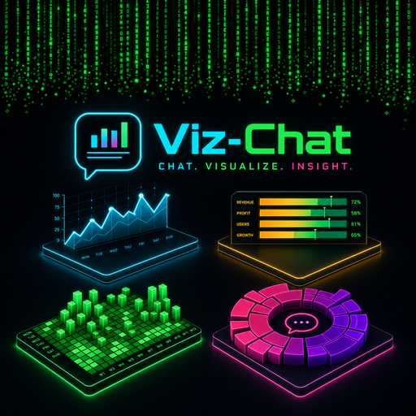
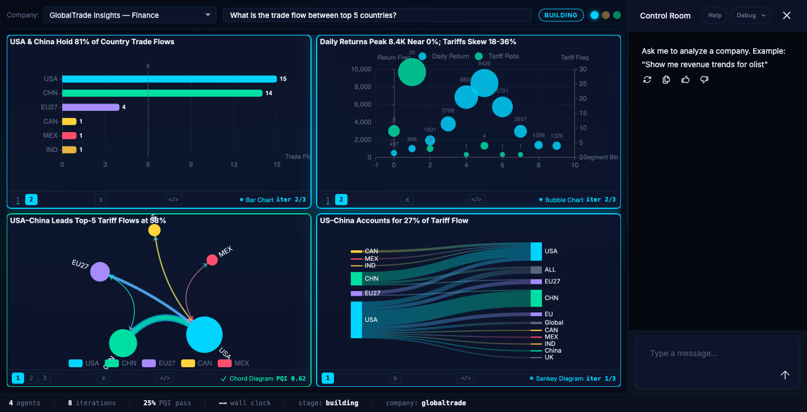
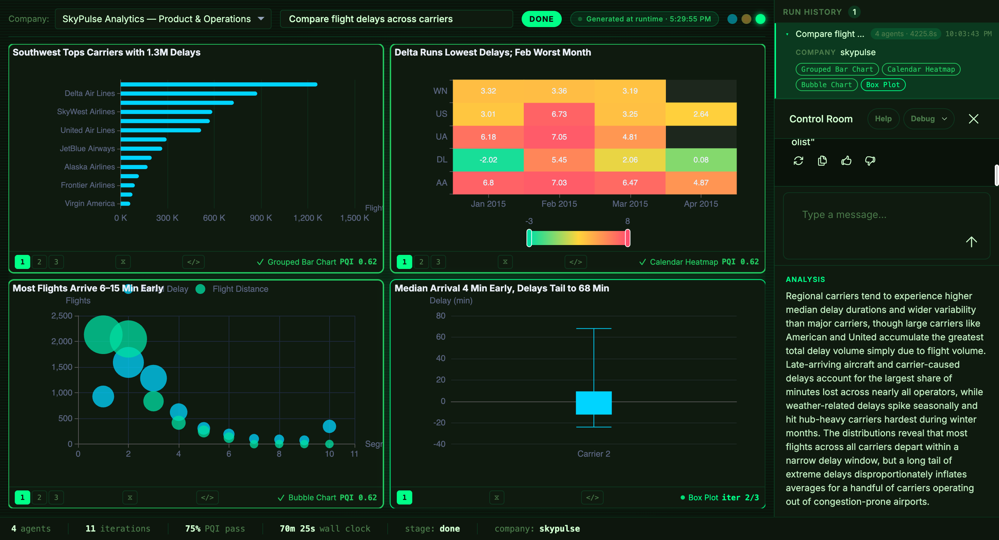
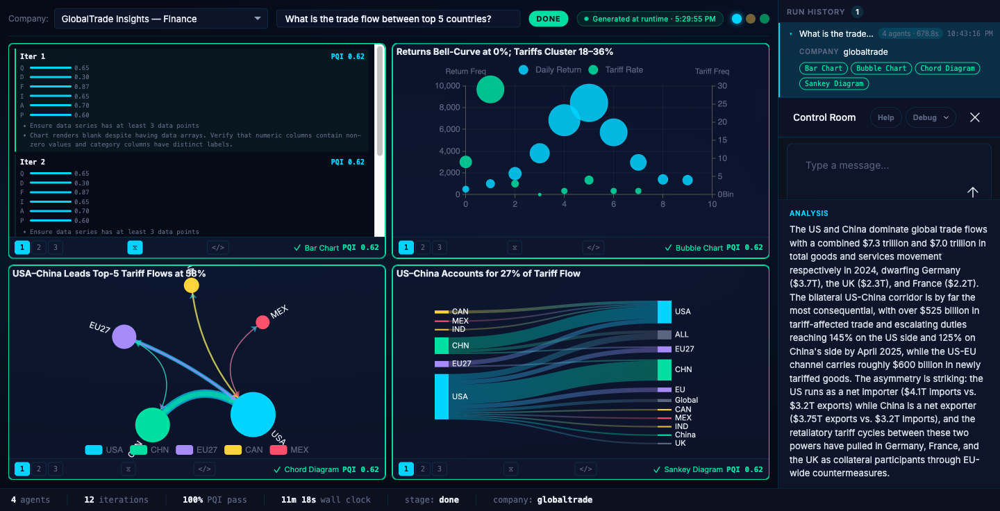
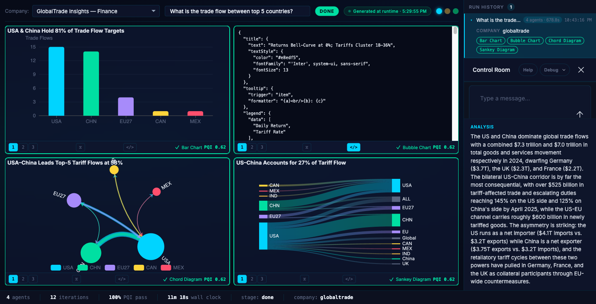

<p align="center">
  
</p>

# Control Room

**Ask a question. Get a dashboard. Watch it grade itself.**

Control Room turns a natural language question into a 4-panel interactive dashboard — then evaluates its own work and throws away anything that doesn't pass. You type "show me delivery bottlenecks for Olist" and watch four agents spin up in parallel, each building a different visualization against 100K real e-commerce orders. Every panel gets scored. Bad iterations get rolled back. The final dashboard gets graded by an automated interaction test suite before you ever see it.

The input is a chat sidebar. The output is not text — it's four interactive ECharts panels with tooltips, hover states, and real data rendered from a SQLite database with millions of rows. The chat is just the trigger. The dashboard is the product.


---

## What You See

Each panel has **iteration tabs** — click [1], [2], [3] to see how the chart evolved across RALPH iterations. A `⧖` button toggles the trace view showing PQI pillar breakdowns (Q/D/F/I/A/P) and fix suggestions per iteration. A `</>` button toggles the raw ECharts JSON config. The status bar shows live agent count, total iterations, PQI pass rate, DQI score, and wall clock time. A run history sidebar lets you browse past queries.

The pipeline stages are visible in real-time. When you submit a query, the stage badge transitions through `BUILDING` → `VERIFYING` → `DONE` while panels populate one by one:



The CopilotKit sidebar is aware of the full dashboard state — company, pipeline stage, agent statuses, quality scores — via `useCopilotReadable`. It's not a disconnected chat window. It's context-aware steering.

---

## Try It

```bash
pnpm install
pnpm seed        # loads 3 real datasets into SQLite
pnpm dev         # starts client + server
```

Requires `ANTHROPIC_API_KEY` in `.env`. Open `localhost:5173` and type a query in the CopilotKit sidebar.

**Queries to try:**

| Query | What Happens |
|---|---|
| "Show me revenue trends for olist" | Line chart + bar + pie + gauge. Trend intent triggers time-series ranking |
| "Compare flight delays across carriers for skypulse" | Grouped bar + box plot + horizontal bar + heatmap. Comparison intent fires |
| "What's the trade flow between top 5 countries?" | Sankey + treemap + stacked area + choropleth. Flow + composition intents |
| "Give me a risk dashboard for skypulse delays" | Gauge + distribution + scatter + line. Risk intent activates gauge/distribution affinity |

Switch datasets with the company selector dropdown. Switch themes with the three dots in the header (Deep Space / Obsidian / Phosphor).



---

## Why This Project Exists

Three years of "AI-powered" apps and the output is still text in a box. The hackathon brief says it directly: *"every AI-powered app has been a chatbot wearing a trench coat."*

Control Room is a response to that. The agent doesn't return text — it returns a rendered, interactive, quality-scored dashboard. The UI isn't a wrapper around a model response. The UI is the model response.

But generative UI has a quality problem. An LLM can produce a chart config on the first try, but it's often wrong — mismatched axes, placeholder data, wrong chart type for the data shape. The interesting question isn't "can an agent generate a dashboard?" It's "can an agent tell when its dashboard is bad and fix it?"

That's what RALPH does. That's why the eval suite exists. The quality isn't in the prompt engineering. It's in the feedback loop.

---

## How It Maps to the Challenge

| Judging Criteria | What We Built | Where |
|---|---|---|
| **Dynamic Component Generation** | 30+ chart types selected at runtime from a scored catalog. A2UI component catalog registers `EChartsPanel` as a structured component Claude can generate as JSON | `viz-catalog.ts`, `ranker.ts`, `a2ui/echarts-catalog.tsx` |
| **Agentic Feedback Loops** | RALPH loop: 4 agents iterate independently with dual-tier eval (DOM + vision), regression rollback, and stagnation-breaking. CopilotKit sidebar for human steering | `ralph.ts`, `frame-store.ts`, `eval-dom.ts`, `eval-vision.ts` |
| **Latency-Optimized Rendering** | DOM eval gates vision eval — if mechanical score < 0.6, skip the Claude vision call entirely. Don't waste an API round-trip on a broken chart | `ralph.ts`, `eval-dom.ts` |
| **Tool-Enabled Interfaces** | AG-UI protocol streams every tool call, state delta, and step transition to the frontend via SSE EventEncoder. Each panel build is a structured tool call with typed args and results | `agent.ts`, `state-bus.ts`, `useControlRoom.ts` |

**Protocols used:** AG-UI (event streaming via EventEncoder), A2UI (EChartsPanel component catalog), CopilotKit (sidebar runtime + `useCopilotReadable` context sharing)

---

## System Architecture

```
                            ┌─────────────────────────┐
                            │      User Query         │
                            │  "revenue trends for    │
                            │   olist by category"    │
                            └───────────┬─────────────┘
                                        │
                    ┌───────────────────────────────────────┐
                    │           ORCHESTRATOR                │
                    │                                       │
                    │  1. PARSE ─── intent + entity NLP     │
                    │  2. PROBE ─── profile data shape      │
                    │  3. RANK ──── score viz types          │
                    │  4. PARTITION ─ assign dimensions      │
                    └──────────┬────────────────────────────┘
                               │
              ┌────────────────┼────────────────┐
              │                │                │
     ┌────────▼──────┐ ┌──────▼────────┐ ┌─────▼───────┐
     │   Agent 1     │ │   Agent 2     │ │  Agent 3-4  │
     │   (line)      │ │   (bar)       │ │  (pie/gauge)│
     └────────┬──────┘ └──────┬────────┘ └─────┬───────┘
              │               │                │
              └───────────────┼────────────────┘
                              │
                   ┌──────────▼──────────┐
                   │    RALPH LOOP       │
                   │  (per agent, ≤4x)   │
                   │                     │
                   │  Render ECharts     │
                   │       │             │
                   │  DOM Eval (11)──────┤─── score < 0.6?
                   │       │             │    skip vision
                   │  Vision Eval (6)    │
                   │       │             │
                   │  PQI Score ─────────┤─── regression?
                   │       │             │    rollback
                   │  Converged? ────────┤─── stagnant?
                   │       │             │    break strategy
                   │       ▼             │
                   │  Best Frame Store   │
                   └──────────┬──────────┘
                              │
                   ┌──────────▼──────────┐
                   │    VERIFY STAGE     │
                   │                     │
                   │  Puppeteer connects │
                   │  to live dashboard  │
                   │                     │
                   │  T1: Panel Render   │
                   │  T2: Console Health │
                   │  T3: Design Tokens  │
                   │  T4: Tooltip Config │
                   │  T5: Responsive     │
                   │                     │
                   │  DQI (7 dimensions) │
                   │  Target: ≥ 0.90     │
                   └──────────┬──────────┘
                              │
                   ┌──────────▼──────────┐
                   │  4-Panel Dashboard  │
                   │  + CopilotKit       │
                   │  + Theme System     │
                   │  + Run History      │
                   └─────────────────────┘
```

### AG-UI Event Streaming

The Express server uses an `EventEncoder` from `@ag-ui/encoder` to stream structured events over SSE. This is what makes the frontend feel live — each pipeline stage, each agent iteration, each tool call streams as it happens, not after the whole pipeline completes.

```
Server (Express)                           Client (React)
─────────────────                          ──────────────
orchestrator.ts                            useControlRoom.ts
     │                                          │
     ├─ STEP_STARTED("parse")                   │
     ├─ STATE_SNAPSHOT({stage, agents})  ──SSE──▶│ update state
     ├─ TOOL_CALL_START("build-panel")           │
     ├─ TOOL_CALL_ARGS({vizType, dim})           │
     ├─ TOOL_CALL_END                            │
     ├─ TOOL_CALL_RESULT({pqi, frame})  ──SSE──▶│ render panel
     ├─ STEP_FINISHED("verify")                  │
     └─ STATE_SNAPSHOT({dqi: 0.91})     ──SSE──▶│ final score
```

---

## RALPH: the agent that disagrees with itself

Most generative UI projects call an API and render the result. RALPH calls the API, renders the result, evaluates it, and if the evaluation fails — it tries again with targeted fixes. Up to 4 iterations per panel.

**Two-tier eval is the novel part.** DOM structural checks (fast, code-based) gate whether the more expensive Claude vision eval runs. Only configs passing the DOM tier get screenshotted and judged by the LLM. Then the entire assembled dashboard gets a second pass (DQI) via Puppeteer interaction tests. It's eval all the way down.

**Tier 1 — DOM eval.** 11 deterministic checks: ECharts canvas exists, title is descriptive, axes labeled, Deep Space palette compliance, design tokens applied, no NaN values, ≥3 data points, tooltip configured, Inter font. Each failed check generates a specific fix instruction. Mechanical score = pass count / 11. If score < 0.6, tier 2 is skipped — don't burn an API call on a chart with no axes.

**Tier 2 — Vision eval.** Screenshot sent to Claude Sonnet. Scores 6 pillars:

```
PQI = 0.25×Q + 0.20×D + 0.20×F + 0.15×I + 0.10×A + 0.10×P

Q = Question Relevance    D = Data Density      F = Fidelity
I = Interactivity          A = Accessibility     P = Polish
```

**Regression rollback.** Frame store tracks every iteration's ECharts config + eval scores. If PQI drops >5% from the running best, the agent rolls back and regenerates with escalated fix instructions. Bad iterations get discarded, not shipped. You can see this in the UI — click the iteration tabs on any panel to see the progression.

**Stagnation breaking.** MD5 fingerprint of chart skeleton structure detects byte-identical outputs. After 2 stagnant iterations, the agent cycles through break strategies: restructure data grouping, reverse axis orientation, aggregate differently.

### What RALPH catches in practice

Click the ⧖ button on any panel to open the trace view. It shows the PQI pillar breakdown (Q/D/F/I/A/P) for every iteration, the specific fix instruction that drove the next attempt, and whether the panel converged or got rolled back.



Click the `</>` button to inspect the raw ECharts JSON config the agent generated. Every panel's config is fully transparent — you can see exactly what the LLM produced and what the eval scored.



These aren't hypothetical. Every panel in every run goes through this scoring loop. The difference between RALPH and a one-shot generator is that bad iterations get detected, rolled back, and regenerated automatically.

---

## DQI: the dashboard grades itself

After all four panels converge, the verify stage connects Puppeteer to the live dashboard at `localhost:5173` and runs interaction tests against the rendered output.

| Dimension | Weight | What It Measures |
|---|---|---|
| Completeness | 20% | All 4 panel slots have rendered canvas/SVG elements |
| Accuracy | 20% | Panel data series match source database rows |
| Fidelity | 15% | % of panels above PQI convergence threshold |
| Consistency | 15% | Design tokens applied uniformly across panels |
| Interactivity | 10% | Tooltips and hover states functional |
| Console Health | 10% | Zero runtime errors in browser console |
| Performance | 10% | Render time under threshold |

Target: 0.90. Runs up to 3 verification cycles. Breaks early when threshold met and no critical issues remain. The status bar shows the DQI breakdown live: `C:1.0 A:0.9 F:0.8 D:1.0 I:0.7 H:1.0 P:0.9`.

---

## How We Built This: 4 Agents, Zero Merge Conflicts

The product was built by 4 parallel Claude Code agents in a single 2.5-hour session. Each agent owned a disjoint set of files. No merge conflicts. 16 commits. ~8,000 lines of TypeScript.

```
┌──────────────────────────────────────────────────────────────────┐
│                    PARALLEL AGENT SESSIONS                       │
│                                                                  │
│  ┌──────────────┐  ┌──────────────┐  ┌────────────┐  ┌────────┐│
│  │   BUILDER    │  │   THEMES     │  │    DATA    │  │ CHARTS ││
│  │              │  │              │  │            │  │        ││
│  │ orchestrator │  │ App.css      │  │ seed.ts    │  │ viz-   ││
│  │ ralph.ts     │  │ App.tsx      │  │ schema.sql │  │ catalog││
│  │ verify.ts    │  │ PanelFrame   │  │ db.ts      │  │ ranker ││
│  │ agent-runner │  │ Compositor   │  │ baseline   │  │ promote││
│  │ dqi.ts       │  │ StatusBar    │  │ raw/olist  │  │ dim-   ││
│  │ interaction- │  │ CompanySel   │  │ raw/flights│  │ partit-││
│  │   tests.ts   │  │ RunHistory   │  │ raw/favori │  │ ioner  ││
│  │ frame-store  │  │ design-tkns  │  │            │  │ echarts││
│  │ eval-dom     │  │ useTheme     │  │            │  │ catalog││
│  │ eval-vision  │  │ a2ui catalog │  │            │  │        ││
│  │ state-bus    │  │              │  │            │  │        ││
│  │              │  │              │  │            │  │        ││
│  │ 13 files     │  │ 10 files     │  │ 5 files    │  │ 5 files││
│  └──────────────┘  └──────────────┘  └────────────┘  └────────┘│
│                                                                  │
│  Pipeline logic     Visual system     Data infra     Selection  │
│  + eval suite       + 3 themes        + 3 datasets   + ranking  │
│  + quality gates    + AG-UI/A2UI      + 8 tables     + scoring  │
└──────────────────────────────────────────────────────────────────┘
```

The separation is architectural, not cosmetic. Builder never touches CSS. Themes never touches the database. Data never touches the eval suite. Chart types never touches the pipeline. Each agent had full context on its domain and zero context on the others.

This is what "agentic interfaces" looks like when you point the agents at the build process itself.

---

## The ML Concepts Worth Knowing About

**Eval suite as first-class artifact.** The eval isn't a test you run after shipping. It's in the loop. Every chart iteration gets graded before the next iteration starts. The system's quality is bounded by the eval, not by prompt engineering.

**Karpathy ratchet for chart quality.** PQI can only ratchet upward — if an iteration regresses, it gets discarded and the best prior frame is restored. The agent can't accidentally make things worse. The frame store preserves every iteration's full state, so rollback is instant.

**Intent-to-visualization affinity matrix.** Not a keyword lookup. A scored matrix mapping 9 intent categories to 9 visualization categories, with continuous affinity values. "Trend" maps to trends (1.0) but also to comparison (0.4) and heatmap (0.3). Combined with data shape profiling (row count, time series detection, hierarchy presence) for ranked results that are both relevant and diverse.

**Chart type promotion.** Base types promote to richer variants when the data supports it. `line` → `stacked-area` when composition intent is detected and ≥2 segments exist. `bar` → `horizontal-bar` when >10 categories would crowd the x-axis. 30+ promotion rules.

**Structural fingerprinting for stagnation.** MD5 hash of chart skeleton. If two consecutive iterations produce the same fingerprint, the agent is stuck. Rotating break strategies force diversity without random noise.

---

## Tech Stack

| Layer | Technology |
|---|---|
| AI | Claude (Anthropic SDK) — query parsing, chart config generation, vision eval |
| Frontend | React 19 · Vite 6 · ECharts 5 · CopilotKit sidebar |
| Backend | Express 5 · TypeScript · tsx |
| Database | SQLite (better-sqlite3) · 8 table types · 3 real datasets |
| Eval | Vitest (160 tests) · Puppeteer interaction tests · DQI scoring |
| Protocols | AG-UI (EventEncoder SSE) · A2UI (EChartsPanel catalog) · CopilotKit (runtime + sidebar) |

## Datasets

Three real-world datasets, loaded via `pnpm seed`. No synthetic data. Every chart renders actual rows from the database.

| Dataset | Scale | Domain |
|---|---|---|
| **Olist** | 100K+ orders | Brazilian e-commerce — revenue, reviews, delivery, categories |
| **SkyPulse** | 5.8M flights | Aviation — delays, routes, carriers, airports |
| **GlobalTrade** | Multi-country | International trade — tariffs, flows, commodities |

## Chart Type Catalog

30+ visualization types across 9 categories. Each type has `whenToUse`, `whenToAvoid`, data requirements, and promotion rules.

| Category | Types |
|---|---|
| Trends | line, area, stacked-area, step-line |
| Comparison | bar, grouped-bar, stacked-bar, horizontal-bar |
| Distribution | histogram, box-plot, violin, density |
| Composition | pie, donut, treemap, sunburst |
| Relationship | scatter, bubble, parallel-coords, radar |
| Flow | sankey, chord |
| Gauge | gauge, kpi-card |
| Geographic | choropleth, bubble-map |
| Heatmap | heatmap, calendar-heatmap |

## Status

160/161 tests pass. The one timeout is an integration test requiring a live Claude API call for the full AG-UI event sequence. Everything else — RALPH loop, ranking engine, theme system, data layer, frame store, eval suite — is wired end-to-end.

~8,000 lines of TypeScript. 45 source files. 10 test files. 3 themes. 16 commits from 4 parallel agents in 2.5 hours.

---

Built for the [Generative UI Global Hackathon: Agentic Interfaces](https://lu.ma/generative-ui-hackathon) · AI Tinkerers Atlanta · May 9, 2026
